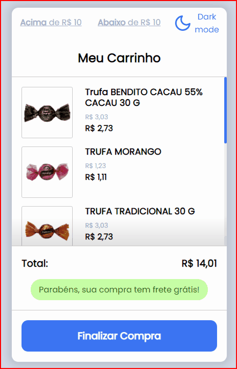

## 💻 Projeto
Projeto desenvolvido com `ReactJS` para o teste de habilidades <b>Frontend Pleno</b> para a Codeby.

Foi feito o consumo da api json para listar os produtos do carrinho.

Aparece a mensagem de frete grátis apenas quando o valor do carrinho é acima de R$ 10,00.

Também foi adicionado a funcionalidade de dark mode (modo escuro).

## 🤔 Como executar

- `git clone https://github.com/salvimateus/teste-codeby-1.git`
- execute `yarn` na pasta `web`
- `yarn start` na pasta `web`

## 📱 Apresentação
 

<h1 align="center">
    
</h1>

---

With 💙 by Mateus Salvi